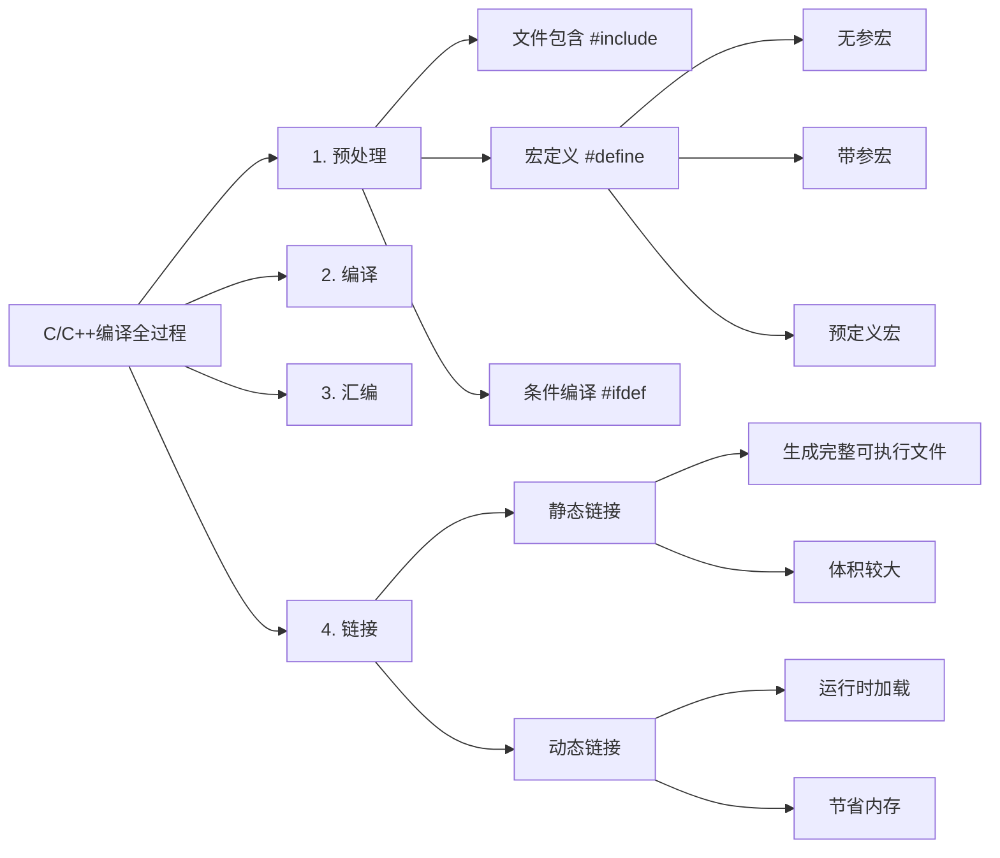

## 📝 基本信息
- **原文链接**: [CSDN博客](https://blog.csdn.net/qq_40765537/article/details/105940800)
- **分类标签**: C/C++, 编译原理, 预处理指令- 
**作者**: qq_40765537

## 🎯 快速了解
本文详细解析了C/C++程序的完整编译过程，包括预处理、编译、汇编和链接四个关键阶段。重点讲解了预处理阶段的三大指令（文件包含、宏定义、条件编译）的实现原理和使用注意事项，并对比了静态链接与动态链接的技术特点。文章通过具体代码示例和原理图示，帮助开发者深入理解编译器底层工作机制。

## 🗺️ 知识图谱

## 📚 内容解读

### 一、预处理阶段
预处理是编译的第一步，主要处理源代码中的预处理指令：

1. **文件包含**
- 将`#include`指令替换为头文件实际内容
- 两种形式：`#include "local.h"`（优先本地目录）和`#include <system.h>`（系统目录）
2. **宏定义**
- 无参宏：`#define PI 3.1415926`
- 带参宏：`#define MULTIPLY(x,y) ((x)*(y))`（注意括号必要性）
- 预定义宏：`__LINE__`、`__FILE__`等内置宏
3. **条件编译**
- `#ifdef/#ifndef` 防止头文件重复包含
- `#if` 实现条件代码块选择

### 二、编译阶段
编译器进行核心处理：
- 词法分析：将源代码分解为token
- 语法分析：构建抽象语法树(AST)
- 语义分析：类型检查等
- 代码优化与生成：输出汇编代码(.s文件)

### 三、汇编阶段
- 将汇编代码转换为机器码(.o文件)
- 生成符号表（未分配地址的符号引用）

### 四、链接阶段
1. **静态链接**
- 将库代码直接嵌入可执行文件
- 优点：执行快、部署简单
- 缺点：体积大、更新困难
2. **动态链接**
- 运行时加载共享库(DLL/.so)
- 优点：节省内存、便于更新 
- 缺点：依赖环境配置

## 💡 关键洞见
1. **宏定义的陷阱**
- 必须用括号包裹参数：`#define SQUARE(x) ((x)*(x))`
- 多语句宏需用`do{...}while(0)`包裹
2. **头文件保护范式**
```c
#ifndef _HEADER_H_
#define _HEADER_H_ 
// 头文件内容
#endif
```
3. **符号解析过程**
链接器通过符号表解决跨文件引用，未解析符号会导致"undefined reference"错误

## 🔗 扩展阅读
- [GCC编译过程详解](https://gcc.gnu.org/onlinedocs/gcc-10.2.0/gcc/Invoking-GCC.html)
- [动态链接库最佳实践](https://www.ibm.com/docs/en/aix/7.2?topic=concepts-shared-libraries)
- [C++20模块替代头文件](https://en.cppreference.com/w/cpp/language/modules)