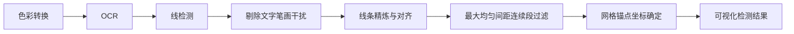

### **step0**: 色彩转换

```python
img_rgb=cv2.cvtColor(img,cv2.COLOR_BGR2RGB)
gray=cv2.cvtColor(img,cv2.COLOR_BGR2GRAY)
```
- 描述
    - COLOR_BGR2RGB：将“蓝、绿、红”颜色通道的排列顺序调整为“红、绿、蓝”
    - COLOR_BGR2GRAY：将彩色图像转为灰色图像，公式如下。
$$
\text{RGB[A] to Gray:} \quad Y \leftarrow 0.299 \cdot R + 0.587 \cdot G + 0.114 \cdot B
$$

- 反推时可以直接根据公式反向计算，并且令 Alpha 为最大通道范围的值。公式如下。

$$
\text{Gray to RGB[A]:} \quad R \leftarrow Y, \, G \leftarrow Y, \, B \leftarrow Y, \, A \leftarrow \max(ChannelRange)
$$

### **step1**: OCR

```
ocr=PaddleOCR(
    use_angle_cls=True,
    lang="ch",
    det_db_thresh=0.3,
    det_db_box_thresh=0.3
)

full_result=ocr.ocr(
    img_rgb,
    det=True,
    rec=True,
    cls=True
)
labeled=ocr_and_extract(full_result)
print(f"OCR labels: {len(labeled)}")
for name, (mx, my, score, src) in sorted(labeled.items()):
    print(f"  {name} -> ({mx},{my}) [{src}]")
```

- 描述：
  - PaddleOCR
    - use_angle_cls=True：方向分类开关，如果开启，遇到倾斜、竖排或者倒置的文字时，模型会自动把它“扶正”后再进行识别，能大幅提升非水平文字的识别准确率。
    - lang："ch" 代表加载中文（简体）+ 英文 + 数字的混合识别模型。
    - det_db_thresh：文本检测二值化阈值。这是文本检测（DB算法）的第一步门槛。模型会先输出一张“概率图”，这个参数决定了概率图中，得分大于多少的像素点才会被认为是“文字的一部分”。
        - 作用：控制模型对文字区域的敏感度。
            - 调低（如 0.2）：模型会更敏感，能检测到更模糊、更浅的文字，但可能会把背景里的噪点误当成文字。
            - 调高（如 0.4）：模型会更严格，只保留非常清晰的文字区域，但可能会导致模糊文字漏检。
    - det_db_box_thresh=0.3：文本框保留阈值。这是文本检测的第二步门槛。模型框出一个文本区域后，会计算这个框内所有像素的平均得分。只有平均得分高于这个阈值的框，才会被最终保留下来。
        - 作用：过滤掉质量差的检测框。
            - 调低（如 0.2）：能保留更多的小字体或低分辨率的文字框，但容易产生一堆乱七八糟的错误框（误检）。
            - 调高（如 0.5 或 0.6）：输出的文本框会更干净、更可靠，但可能会直接丢弃掉一些稍微模糊的文字（漏检）。
  - ocr.ocr
    - 这段代码是在调用 PaddleOCR 引擎的核心方法 ocr()，对传入的图像数据 img_rgb 执行完整的文字识别流水线。这三个参数（det, rec, cls）就像是三个功能模块的独立开关，用来控制 OCR 引擎具体要执行哪些步骤。结合你上一段代码初始化的模型，它们的具体含义如下：
        - det=True：det 就是 Detection，文本检测。为 True 时，表示开启文本检测模块。其作用是，模型会先在整张 img_rgb 图片上扫描，找出所有可能包含文字的区域，并画出边界框（坐标）。这是文字识别的第一步，负责解决“文字在哪里”的问题。
        - rec=True：rec 是 Recognition，文本识别。为 True 时，表示开启文本识别模块。其作用时，模型会把 det 步骤框出来的文字区域“抠”出来，识别里面的具体字符内容（比如识别出“你好”、“ABC”）。这是第二步，负责解决“文字是什么”的问题。
        - cls=True：cls 是 Classification，方向分类。为 True 时，表示开启方向分类模块。其作用是，在识别文字之前，先判断这个文字区域是不是歪的（比如旋转了 180°）。如果检测到方向不对，它会自动把文字“扶正”后再交给 rec 模块去识别。这对应了你初始化参数里的 use_angle_cls=True，负责解决“文字方向对不对”的问题。
  - 自定义函数 ocr_and_extract
    - 解析与提取：遍历OCR原始数据，提取文本、置信度和坐标，并打印调试信息。
    - 文本清洗：通过替换易混淆字符（如将l变为1）和统一标点，修正OCR的识别错误。
    - 合并排序：按从上到下、从左到右的顺序排列文本，并将断行的句子智能拼接完整。
    - 正则匹配：利用多套正则表达式规则，从文本中精准抓取棋子、字母等对应的坐标数据。
    - 择优录入：对比识别结果的置信度，去重并保留最准确的一组坐标数据存入字典返回。
- 最终输出：
    - 识别得到的点的名称和坐标，示例例如下所示（方框中的字母是程序中定义的点的类型，对应不同的正则表达式匹配规则）：
```bash
OCR labels: 4
  C -> (2,2) [D]
  D -> (4,0) [X]
  帅 -> (1,-1) [P]
  马 -> (-2,-1) [P]
```

### **step2**: 线检测

#### # **step2-1: 得到用于形态学变换的结构元素 kernel**
```python
kernel = cv2.getStructuringElement(cv2.MORPH_RECT,(2,2))
```
- 返回符合指定大小和形状的结构元素，用于形态操作。该函数构造并返回结构元素，可以进一步传递给腐蚀、膨胀或高级形态学变换。但你也可以自己构造一个任意的 binary mask，并将其作为结构元素。
  - 腐蚀：简单来说，腐蚀就像是把图像中的高亮（白色）区域“削薄”或“缩小”。它的核心原理是：使用一个特定的结构元素（也叫核，kernel）在图像上滑动，计算该结构元素覆盖区域内像素的最小值，并将这个最小值赋给中心像素。
  
  _腐蚀效果_
  - 膨胀：简单来说，膨胀就像是把图像中的高亮（白色）区域“变胖”或“扩张”。它的核心原理是：使用一个特定的结构元素（核，kernel）在图像上滑动，计算该结构元素覆盖区域内像素的最大值，并将这个最大值赋给中心像素。
  
  _膨胀效果_
  - 高级形态学变换：是 OpenCV 中用于执行高级形态学变换的“全能王”函数。它把基础的腐蚀（erode）和膨胀（dilate）操作进行了组合，封装成了更强大的功能，比如开运算、闭运算、梯度运算等。其参数包括一个 op (操作类型)，它决定了具体执行哪种高级形态学操作。常用的有：
    - `cv2.MORPH_OPEN`（开运算）：先腐蚀后膨胀。主要用来去除图像中的小白点噪声，同时基本保持物体原有大小。
    - `cv2.MORPH_CLOSE`（闭运算）：先膨胀后腐蚀。主要用来填充物体内部的小黑洞，或者连接原本断裂的物体。
    - `cv2.MORPH_GRADIENT`（形态学梯度）：膨胀图减去腐蚀图。可以直接提取出物体的轮廓。
    - `cv2.MORPH_TOPHAT`（顶帽/礼帽）：原图减去开运算结果。用来提取比周围亮的细节（比如提取噪点或细线条）。
    - `cv2.MORPH_BLACKHAT`（黑帽）：闭运算结果减去原图。用来提取比周围暗的细节（比如提取物体内部的黑洞）。
  
  _高级形态学变换效果_

#### # **step2-2: 使用自适应阈值调整图像**
```python
cv2.adaptiveThreshold(gray,255,cv2.ADAPTIVE_THRESH_GAUSSIAN_C,cv2.THRESH_BINARY_INV,15,3)
```
- 描述：
  - 对数组应用自适应阈值。
  - 公式如下，其中 $T(x,y)$ 是使用自适应方法（传入 adaptiveMethod 参数）为每个像素单独计算的阈值。

（1）如果 `thresholdType == cv2.THRESH_BINARY`，则使用：
$$
dst(x, y) =
\begin{cases}
\text{maxValue} & \text{if } src(x, y) > T(x, y) \\
0 & \text{otherwise}
\end{cases}
$$
（2）如果 `thresholdType == cv2.THRESH_BINARY_INV`，则使用：
$$
dst(x, y) =
\begin{cases}
0 & \text{if } src(x, y) > T(x, y) \\
\text{maxValue} & \text{otherwise}
\end{cases}
$$
- 该函数可原地处理图像。
- 输出为二值图像。

#### # **step2-3: 对图像应用闭运算连接断裂的线条**
```python
binary_full = cv2.morphologyEx(binary_full,cv2.MORPH_CLOSE,kernel)
```
- 描述
  - 使用了 `step2-1` 介绍的 `cv2.MORPH_CLOSE` 操作。

#### # **step2-4: 使用自定义线检测函数检测线条**
```python
h_segs,v_segs=detect_and_merge_lines(binary_full,gray.shape)
```
- 传入参数
  - binary: 二值图像
  - gray_shape: 图像宽高

- 内部调用
  
```python
cv2.HoughLinesP(
    binary, 
    rho=1, 
    theta=np.pi/180,
    threshold=thresh,
    minLineLength=min(h_img, w_img)//min_ratio,
    maxLineGap=max_gap
)
```
- 描述：
  - 使用概率霍夫变换在二值图像中查找线段。
  - binary: 传入的图像。（非二值图也能做？是否有必要转成二值图？）
  - threshold: 累加器阈值参数。仅返回获得足够投票的行（$> threshold$）
  - minLineLength: 线段最小长度，在实际处理时提供了多个 min_ratio 来计算不同的 minLineLength。
  - maxLineGap: 同一直线上连接点之间的最大允许间隙，在实际处理时提供了多个 max_gap。
  - 输出：lines，线段的数组。每个线段由一个 4 元素的向量 $(x_1,y_1,x_2,y_2)$ 表示，其中 $(x_1,y_1)$ 和 $(x_2,y_2)$ 是每个检测到的线段的端点。
- 最终输出：
  - 所有检测到的水平线和竖直线。

### **step3**：剔除文字笔画干扰
```python
# 构建文字区遮罩: 被文字框覆盖的像素
text_mask = np.zeros(gray.shape, dtype=np.uint8)
if full_result:
    for lg in full_result:
        if lg is None: continue
        for wi in lg:
            bx = np.array(wi[0], dtype=np.int32)
            x1, y1 = np.min(bx, axis=0); x2, y2 = np.max(bx, axis=0)
            x1, y1 = max(0,int(x1)), max(0,int(y1))
            x2, y2 = min(gray.shape[1]-1,int(x2)), min(gray.shape[0]-1,int(y2))
            text_mask[y1:y2+1, x1:x2+1] = 1

# 分类: 线段中点落在文字区 = 文字笔画, 排除
def is_text_line(x1,y1,x2,y2):
    mx, my = int((x1+x2)/2), int((y1+y2)/2)
    if 0<=my<text_mask.shape[0] and 0<=mx<text_mask.shape[1]:
        return text_mask[my, mx] > 0
    return False

h_grid = [s for s in h_segs if not is_text_line(*s)]
v_grid = [s for s in v_segs if not is_text_line(*s)]
print(f"Grid segs (text-filtered): {len(h_grid)} H, {len(v_grid)} V")
```
使用 ocr 识别的文字区域作为文字遮罩，当线检测结果的线条中点落在文字遮罩区域时，认为是文字笔画，而不是平面网格的线条，从而排除掉该线条。

### **step4**: 线条精炼与对齐
```python
def histogram_peak_positions(segments, is_h, min_peak_dist=8):
    if not segments: return []
    if is_h:
        positions = np.array([(y1+y2)/2.0 for _,y1,_,y2 in segments])
        lengths = np.array([np.hypot(x2-x1, y2-y1) for x1,y1,x2,y2 in segments])
    else:
        positions = np.array([(x1+x2)/2.0 for x1,_,x2,_ in segments])
        lengths = np.array([np.hypot(x2-x1, y2-y1) for x1,y1,x2,y2 in segments])
    if len(positions) < 3:
        merged, _ = merge(segments, is_h); return merged

    lo, hi = np.min(positions), np.max(positions)
    if hi - lo < 1: return [float(np.mean(positions))]
    bins = max(15, int((hi-lo)/3))
    hist, edges = np.histogram(positions, bins=bins, range=(lo-1, hi+1), weights=lengths)
    bin_centers = (edges[:-1] + edges[1:]) / 2

    # 找峰
    peaks = []
    for i in range(1, len(hist)-1):
        if hist[i] > hist[i-1] and hist[i] >= hist[i+1] and hist[i] > 0:
            # 精炼: 在峰值bin附近取加权质心
            lo_i, hi_i = max(0, i-1), min(len(hist)-1, i+1)
            mask = (positions >= edges[lo_i]) & (positions < edges[hi_i+1])
            if mask.any():
                refined = np.average(positions[mask], weights=lengths[mask])
                peaks.append((refined, hist[i]))
            else:
                peaks.append((bin_centers[i], hist[i]))

    if len(peaks) < 3:
        merged, _ = merge(segments, is_h); return merged

    peaks.sort(key=lambda x: x[1], reverse=True)
    filtered = [peaks[0]]
    for p, s in peaks[1:]:
        if all(abs(p - fp[0]) >= min_peak_dist for fp in filtered):
            filtered.append((p, s))
    filtered.sort(key=lambda x: x[0])
    return [p for p, s in filtered]

h_pos = histogram_peak_positions(h_grid, True)
v_pos = histogram_peak_positions(v_grid, False)
print(f"Histogram peaks: {len(h_pos)} H, {len(v_pos)} V")
print(f"  H gaps: {[f'{h_pos[i+1]-h_pos[i]:.1f}' for i in range(len(h_pos)-1)]}")
print(f"  V gaps: {[f'{v_pos[i+1]-v_pos[i]:.1f}' for i in range(len(v_pos)-1)]}")
```

这步说白了的逻辑就是，先使用加权直方图（线段越长，密度越高）找出线段最密集、最长的位置。如果线段过少（＜ 3）那么就退而使用聚类算法。

“对齐”是比较形象的说法，因为检测出的构成平面网格的线条很整齐，就好像是把网格线条从纸面中抽出来对齐了一样。

算法最终输出的是所有水平/竖直方向上的检测出的线条。

### **step5**: 最大均匀间距连续段过滤
```python
# 自动检测坐标系行列数: 最大均匀间距连续段
    def auto_grid_size(positions):
        """间距聚类: 相似间距归簇, 最大簇=均匀网格"""
        if len(positions) < 3: return len(positions), positions
        gaps = np.diff(positions)
        # 聚类: gap之间的差异 < 30% → 同簇
        sorted_gaps = sorted(gaps)
        clusters = [[sorted_gaps[0]]]
        for g in sorted_gaps[1:]:
            # 与当前簇中位比较
            cl_med = np.median(clusters[-1])
            if cl_med > 0 and abs(g - cl_med) / cl_med < 0.30:
                clusters[-1].append(g)
            else:
                clusters.append([g])
        # 最大簇
        best_cl = max(clusters, key=len)
        best_gap = np.median(best_cl)
        # 标记属于此簇的gap位置
        is_in_cluster = np.array([abs(g - best_gap) / best_gap < 0.30 if best_gap>0 else False
                                   for g in gaps])
        # 找最长的连续簇段
        best_len, best_start = 0, 0
        cur_len, cur_start = 1, 0
        for i in range(1, len(is_in_cluster)):
            if is_in_cluster[i-1]: cur_len += 1
            else:
                if cur_len > best_len: best_len, best_start = cur_len, cur_start
                cur_len, cur_start = 1, i
        if cur_len > best_len: best_len, best_start = cur_len, cur_start
        return best_len + 1, positions[best_start:best_start + best_len + 1]

    TH, h_pos = auto_grid_size(h_pos)
    TV, v_pos = auto_grid_size(v_pos)
    nh, nv = len(h_pos), len(v_pos)
    print(f"Auto grid: {TH} H × {TV} V")
```
由于平面网格中，行间距、列间距是均匀的，所以从对齐的线条中过滤出行间距、列间距均匀的线条，就可以认为是平面网格。

- 这步最终输出最终确定的所有水平线条和竖直线条。

### **step6**: 网格锚点坐标确定

这一步目标是将从文字区域得到的所有点（及其坐标）映射到平面网格上。

```python
# 1. 每个交点计算"标签存在得分" — 网格线之外的暗像素密度
#    裸交点: 暗像素集中在交叉线上, 被掩膜排除 → 得分低
#    有标签的交点: 标签笔画在线外产生额外暗像素 → 得分高
cell_gap = np.median(np.diff(h_pos)) if len(h_pos)>1 else 20
    r_patch = max(4, int(cell_gap * 0.5))  # 取半格范围
    label_scores = np.zeros((TH, TV))
    for ri in range(TH):
        for ci in range(TV):
            px, py = coord_inters[ri][ci]
            x1, x2 = max(0,px-r_patch), min(gray.shape[1]-1,px+r_patch)
            y1, y2 = max(0,py-r_patch), min(gray.shape[0]-1,py+r_patch)
            if x2-x1<5 or y2-y1<5: continue
            patch = gray[y1:y2, x1:x2].astype(np.float32)
            # 掩膜: 排除水平线带 + 竖直线带 + 交叉中心 (这些是纯网格结构)
            mask = np.ones_like(patch)
            cy, cx = (y2-y1)//2, (x2-x1)//2
            lw = max(1, int(cell_gap * 0.08))  # 网格线宽度约格宽的8%
            mask[max(0,cy-lw):min(patch.shape[0],cy+lw+1), :] = 0
            mask[:, max(0,cx-lw):min(patch.shape[1],cx+lw+1)] = 0
            cw = max(3, int(cell_gap * 0.15))    # 交叉中心区域稍大
            yc1, yc2 = max(0,cy-cw), min(patch.shape[0],cy+cw+1)
            xc1, xc2 = max(0,cx-cw), min(patch.shape[1],cx+cw+1)
            mask[yc1:yc2, xc1:xc2] = 0
            if mask.sum() > 0:
                # 得分 = 掩膜外区域的平均暗度 (255-灰度, 越高越暗)
                label_scores[ri, ci] = np.sum((255.0 - patch) * mask) / mask.sum()

    # 2. 枚举所有有效锚定, 总分 = 各标注点所在交点的标签得分之和
    #    正确锚定下 C,D,帅,马 恰好落在有实际标签的交点上 → 总分最高
    x_lo = max(all_mx) - (TV - 1)  # 例: 4-8=-4
    x_hi = min(all_mx)              # 例: -2
    y_lo = max(all_my)              # 例: 2
    y_hi = min(all_my) + (TH - 1)   # 例: -1+4=3
    print(f"  x_min∈[{x_lo},{x_hi}], y_max∈[{y_lo},{y_hi}] "
          f"(from labels: x={all_mx}, y={all_my})")

    best_anchor = None
    best_score = -1
    for xm in range(x_lo, x_hi + 1):       # xm = 候选 x_min
        for ym in range(y_lo, y_hi + 1):   # ym = 候选 y_max
            # 验证: 所有标注点在此锚定下是否落在网格内
            ok = all(0 <= ym - my < TH and 0 <= mx - xm < TV
                    for mx, my in label_maths.values())
            if not ok: continue
            # 累加各标注点所在交点的标签得分
            score = sum(label_scores[ym - my, mx - xm]
                       for mx, my in label_maths.values())
            if score > best_score:
                best_score = score
                best_anchor = (xm, ym)

    if best_anchor:
        x_min, y_max = best_anchor
        print(f"Best anchor: x_min={x_min}, y_max={y_max} "
              f"(label_score={best_score:.1f})")
    else:
        print("Anchor search failed"); return
```

说白了就是，先判断每一个交叉点是否是需要映射的点坐标，再枚举网格左上角的交叉点的数学坐标，找使得平面网格区域得分最大的左上角坐标。具体思路如下：
- 判断每一个交叉点是否是需要映射的点坐标：依据是该点周围的有效像素密度。特殊交叉点总是有标签存在于其周围，所以可以断定特殊交叉点的位置。
- 找使得平面网格区域得分最大的左上角坐标：先确定枚举范围（根据是否可以将所有特殊交叉点包裹在平面网格范围内来判断），再选择使得平面网格区域得分最大的坐标作为左上角坐标（也就是所有特殊点最可能找对其在平面网格区域内的所在位置的情况）

- 最终输出为确定下来的“网格数学坐标←→像素位置坐标”的映射关系。

### **step7**: 可视化检测结果
```python
graph, points, pt_to_idx = verify_and_build_graph(h_pos, v_pos, binary_full, gray.shape)
```
将平面网格存到数据结构中：
- graph 是一个字典，键是交叉点的 idx，值是二元组，表示交叉点的像素坐标。
- points 是一个列表，列表元素是二元组，存储平面网格的所有交叉点的像素坐标。
- pt_to_idx 是一个字典，将每一个交叉点映射到唯一编号 idx。

```python
visualize(img_rgb, points, graph, pt_to_idx, nh, nv, rows_viz, cols_viz, mapping, labeled)
```

通过上面的函数将平面网格检测结果可视化，如下所示。

_平面网格检测结果_